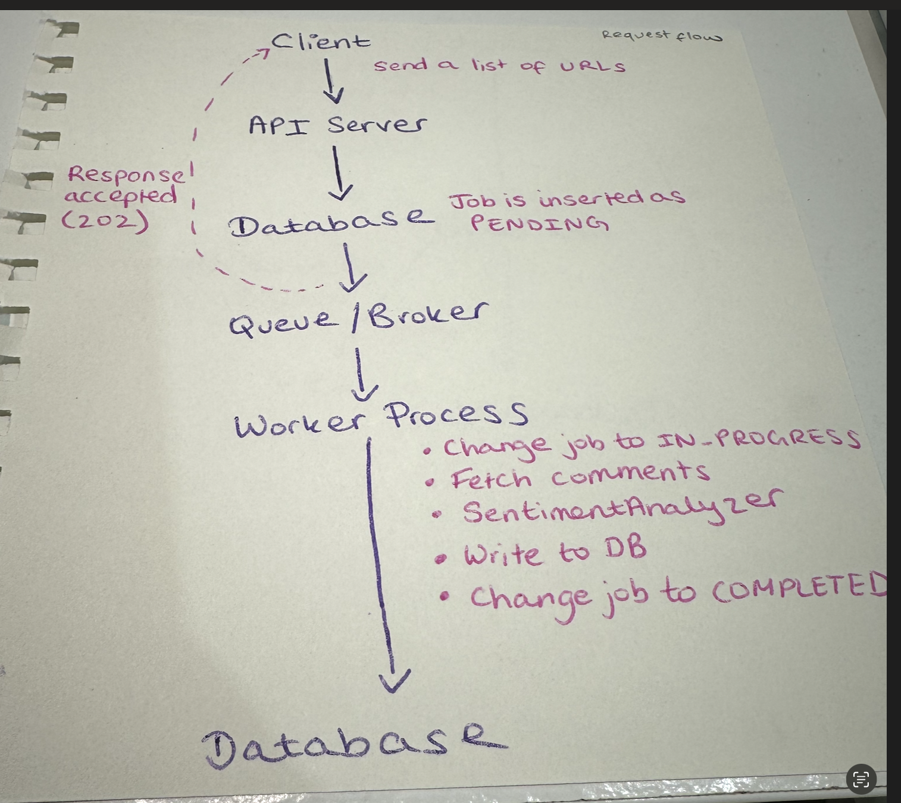
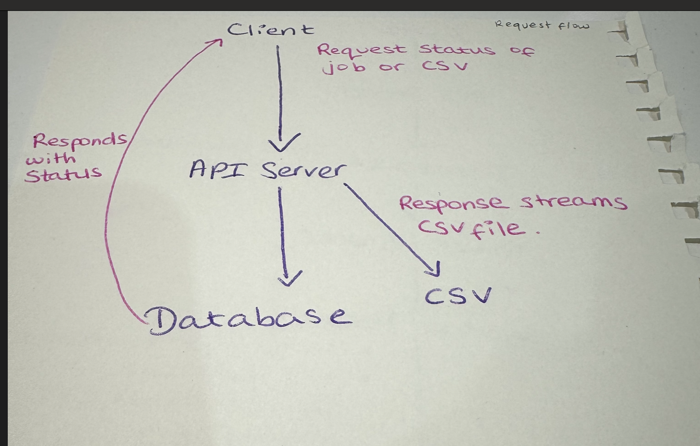
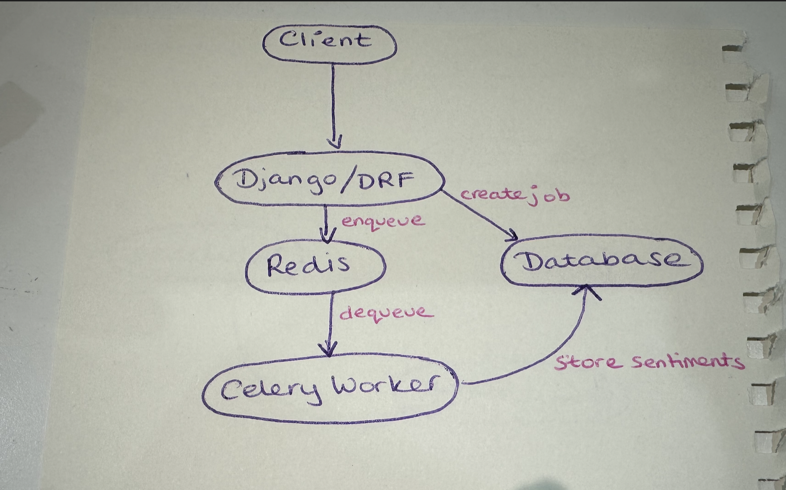
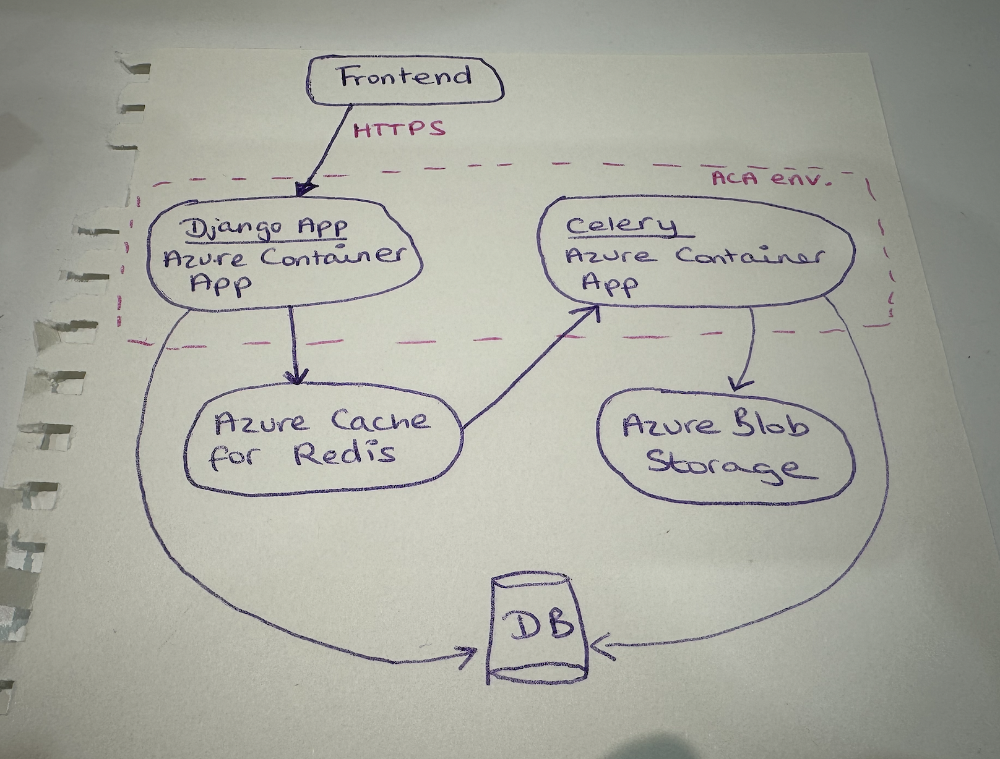
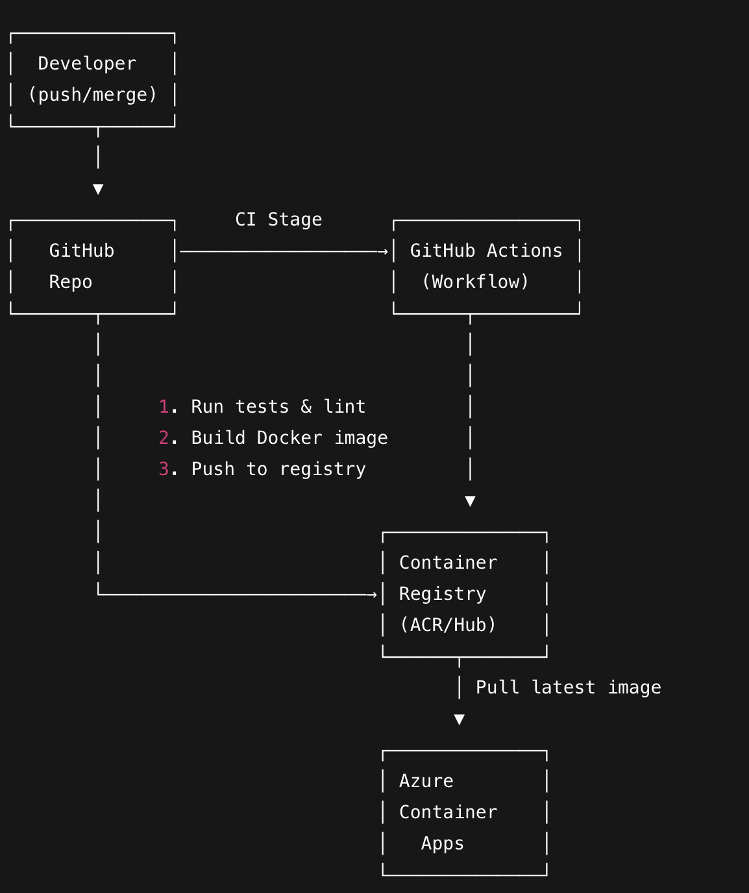

# Solution Design

## Table of Contents

## Overview

Short summary (2–3 paragraphs):

What the system does.

Your guiding principles (MVP → scalable; cost-conscious; maintainable).

Technologies used (Python 3.12, Django/DRF, Celery, Redis, PostgreSQL, Hugging Face Transformers).


## Application Design

--- include logos of the tech stack here !! \
I decided to use **Django** for the application and **Django REST Framework** to implement the API.
* Django's "batteries-included" philosophy allows for rapid development with minimal setup. Since this project is an MVP that needs to be put in front of users as soon as possible to validate value, the Django/DRF combination provides the best balance between speed and productivity/usable/quality. Furthermore, the out-of-the-box combination of ORM for data models, authentication/authorization, and data validation means that we can focus on business logic.
* I looked into other frameworks like Flask and FastAPI, but chose not to use them for this exercise. 
  * Flask is lightweight, which would require setting up components from scratch (ORM, authentication, request handling).
  * FastAPI is a good modern option, especially for async use cases and OpenAPI specs, but, for me, it started to introduce extra learning overhead. I think it would be a good option if the application goes beyond MVP and use-case is validated! 
  
**Toolchain** 
- **Language**: Python 3.12.12
- **Frameworks**: Django & Django REST Framework
- **Task queue**: Celery (for job execution)
- **Broker**: Redis
- **Database**: SQLite in development. Can opt for PostgreSQL in production.

**Why Celery + Redis?** 

**In terms of fetching comments** I haven't implemented this, however, some considerations I would make are as follows:
* Do the platforms have official APIs? What are the options?
  * It looks like the Instagram API is for Businesses/Creators to access their own data, TikTok requires a registration process, and Youtube has an official API that exposes comments (scraping Google Applications is against the Terms of Service).
  * From the above it seems as though we'll need to have a hybrid approach to begin with - scraping for Instagram and TikTok, and integrating Youtube API. 
  * Once ROI is proven we could consider third-party API providers (e.g. Apify).
* Should we limit the number of comments scraped per post? How do we decide on a limit? Is there a sampling method we could use?
* What happens when there are no comments? What about if there's little amount of comments - how does this affect the overall sentiment score?
* We should probably implement logic that avoids fetching comments for a post that already has them in the database. E.g. if an Account Manager has two lists of posts with common links.
* How many links on average will Account Managers be submitting at a time - does this need to be limited? Or we need to consider the performance and scalability of this. 
* 

**To implement the ``SentimentAnalyzer`` class**, I looked into three options: VADER, CardiffNLP Twitter RoBERTa (on Hugging Face), and Azure AI Language. I decided to go with CardiffNLP Twitter RoBERTa because it's trained on a huge amount of tweets (~124M), making it a reasonable choice for social media comments. It's also fine-tuned for sentiment analysis, handles hashtags and emojis, and can classify text as positive, neutral, or negative. It  also required low integration efforts - only needed two Python libraries to get going (``torch`` & ``transformers``) and the example pipeline on Hugging Face was enough to understand how to approach the code. These reasons gave me confidence in being able to justify it to stakeholders, if needed.

On the other hand, VADER is a rule-based lexicon method and weaker when it comes to context - for an application that is presented to stakeholders, even as opportunistic, I preferred the robustness of the Hugging Face model. Azure AI Language would have introduced unnecessary complexity for now (billing, API key storage, etc). However, I wanted to make the approach pluggable, therefore, implemented an Abstract Class and Factory Class. 

**API endpoints**

The URL pattern mapping can be seen in ``jobs/urls.py``

``api/jobs/create`` -> Accepts a list of URLs and executes the job.

``api/jobs/<intLjob_id>/status`` -> GET the status of a job

``api/jobs/<int:job_id>/download/`` -> Download the results of a job as a CSV.

These URLs patterns map to Django REST Framework views in ``jobs/views.py``.

``jobs/tasks.py`` has the Celery tasks.

``tool/celery.py`` has the Celery app configuration. 

**Application structure**
```
.
├── jobs
│   ├── __init__.py
│   ├── admin.py
│   ├── apps.py
│   ├── migrations
│   │   ├── __init__.py
│   ├── models.py
│   ├── tasks.py
│   ├── tests.py
│   ├── urls.py
│   └── views.py
├── sentiment
│   ├── __init__.py
│   ├── analyzer.py
│   └── tests.py
└── tool
│   ├── __init__.py
│   ├── asgi.py
│   ├── celery.py
│   ├── settings.py
│   ├── urls.py
│   └── wsgi.py
├── manage.py
├── requirements.txt
├── Solution.md
├── db.sqlite3
```

I decided to separate the Django project into two apps: ``jobs`` and ``sentiment``. The ``jobs`` app is treated as the orchestration layer (API handling and storage) and the ``sentiment`` app is where the sentiment analysis sits. 

My reasons for separation instead of one app:
* Clarity - obvious at a glance for where to go when navigating the repo. Developer experience is important to me.
* Reusability and Scalability - You can extract the ``sentiment`` app as is. For example, if you decide on another framework, architecture pattern (e.g. microservices etc), or simply want to use it for another project or use-case.


## System Architecture


[User / Frontend]
        |
        v  (HTTPS)
+-----------------------+
| Django API (ACA)      |  <-- Built-in ACA ingress/load-balancing
|  - /jobs (create)     |      across replicas
|  - /jobs/{id}/status  |  --> [Postgres]
|  - /jobs/{id}/csv     |
+----------+------------+
           | enqueue
           v
      [Redis Queue]
           |
           v (dequeue)
+-----------------------+
| Celery Worker (ACA)   |  -> results -> [Postgres]
| (no public ingress)   |  -> CSV -> [Blob Storage] (optional)
+-----------------------+


We deploy the system on Azure Container Apps (ACA) using two containers: a Django API and a Celery worker. The API exposes endpoints to create jobs, check job status, and download results. When a job is created, the API persists job metadata in Postgres and enqueues work on Azure Cache for Redis. The Celery worker (also running on ACA) consumes tasks from Redis, performs comment collection and sentiment analysis, then writes results and status updates back to Postgres (and optionally materializes a CSV to Azure Blob Storage). This design fits the expected usage pattern—fewer than 10 users with bursty activity and non-immediate results—by decoupling request/response from processing. It supports autoscaling during bursts and scales to zero when idle, minimizing cost while keeping the codebase simple (Django + Celery) and maintainable.


how azure container apps handles bursts (and what it means for cost)

Do Container Apps “always run”?
Not necessarily. With Consumption pricing in ACA, you can set minReplicas = 0 (the default), which means the container scales to zero when there’s no traffic/trigger. When new traffic arrives, ACA scales out based on rules (HTTP concurrency, queue depth, cron, etc.) via KEDA.

Why this is good for bursts

During quiet periods, replicas drop to 0 → no compute billed for the app containers.

When a burst arrives (HTTP requests or queue messages), ACA spins up instances quickly to handle load, then scales back down once work drains.

What you pay for (at a high level)

vCPU-seconds and GB-seconds for each container only while it’s running (i.e., non-zero replicas).

Always-on costs for managed services you use: Redis, Postgres, Blob Storage, and logging.

Networking/egress if applicable.

Tuning knobs (cost vs latency):

minReplicas = 0 → cheapest; may introduce cold starts (a few seconds) when a burst begins.

minReplicas = 1 on the API → keeps one warm instance to reduce cold-start latency; small steady cost.

Worker scale rules: e.g., “1 replica per N Redis messages” with a maxReplicas cap (like 5–10).

Resource requests: choose small sizes (e.g., 0.25 vCPU / 0.5–1 GB) for worker/API to keep per-second costs down; scale out horizontally during bursts.

When Azure Functions might be even cheaper:
If your background work is fully event-driven and you don’t want to run Django/Celery, Azure Functions can be cheapest at tiny scales. But given your Django + Celery + Redis stack, ACA keeps your architecture straightforward without refactoring.


The container apps to set up

api (Django/DRF)

Purpose: Receives requests, creates jobs, exposes /jobs, /status, /csv.

Ingress: External (HTTPS) via ACA’s built-in ingress/LB.

Scaling (KEDA HTTP): target concurrency (e.g., 20–50 req/replica), minReplicas: 0 or 1, maxReplicas: 2–3.

Resources: small (e.g., 0.25–0.5 vCPU, 0.5–1 GB RAM).

Secrets/Config: DB URL, Redis URL, Blob SAS/conn string via app settings/Key Vault ref.

Notes: Serve only the API; put static files on Blob Static Website or use Whitenoise.

worker (Celery worker)

Purpose: Dequeues tasks from Redis, scrapes/comments, runs sentiment, writes results.

Ingress: Disabled (no public endpoint).

Scaling (KEDA Redis): scale on queue length (e.g., 1 replica per 5–10 msgs), minReplicas: 0, maxReplicas: 3–5.

Resources: small→medium per replica depending on model size (start 0.5 vCPU/1–2 GB).

Notes: This is the only process consuming from Redis.

(Optional but recommended) scheduler

Pick one of these:

Celery Beat as a tiny always-on container app to schedule periodic tasks, or

ACA Jobs (scheduled) to run containers on a CRON (no always-on cost), or

Azure Functions (Timer trigger) if you prefer serverless scheduling.

Use cases: housekeeping, stale-job sweeps, CSV cleanup/backfills, health checks.

(Optional) ACA Job: db-migrate (on-demand)

Purpose: Run migrations/seeds as a one-shot job during deployments.

Ingress: none. Trigger manually or via pipeline.

Managed services you’ll also create (not ACA): Azure Postgres Flexible Server, Azure Cache for Redis, Azure Storage (Blob), and Log Analytics / App Insights for logs/metrics.


Quick config checklist (copy/paste into your runbook)

Environment: aca-env-{stage} (region close to users)

App: api

Ingress: external HTTPS

Scale: HTTP concurrency 30; min=0 (or 1 for warm), max=3

Resources: 0.5 vCPU / 1 GB

Env: DATABASE_URL, REDIS_URL, BLOB_CONN/SAS

App: worker

Ingress: disabled

Scale: Redis queue length (e.g., 1 per 10 msgs), min=0, max=5

Resources: 0.5 vCPU / 1–2 GB

Scheduler: Celery Beat or ACA Scheduled Job (preferred to avoid always-on)

Observability: Log Analytics + App Insights; capture job_id as correlation id

Security: system-assigned managed identity + Key Vault references for secrets (optional but nice)

Data: Postgres (Basic/Small), Redis (Basic), Blob (Hot)

That’s it. Minimal, scalable, cost-sane, and fits your <10 users, bursty, non-immediate results brief.

                         [User / Frontend]
                                 |
                                 v  (HTTPS)

+==========================================================================+
|        Azure Container Apps Environment (e.g., prod-env / single VNet)   |
|                                                                          |
|   (Managed Ingress / LB)                                                 |
|            |                                                             |
|            v                                                             |
|   +-----------------------+                                              |
|   |  Django API (ACA)     |                                              |
|   |  - /jobs (create)     |                                              |
|   |  - /jobs/{id}/status  |-----> [ Postgres* ]  (write job, read status)|
|   |  - /jobs/{id}/csv     |                                              |
|   +-----------+-----------+                                              |
|               |                                                          |
|               |  enqueue job payload                                     |
|               v                                                          |
|          [ Redis* ]  <=================  dequeue tasks  ==================+
|               ^                                                          |
|               |                                                          |
|   +-----------+-----------+                                              |
|   | Celery Worker (ACA)   |-----> [ Postgres* ]  (write results/status)  |
|   |  (no public ingress)  |-----> [ Blob Storage* ]  (CSV, optional)     |
|   +-----------------------+                                              |
|                                                                          |
+==========================================================================+

* Managed services (Postgres, Redis, Blob) are separate Azure resources.
  They can be public-with-firewall or private via VNet/Private Endpoints.


* Managed services (Postgres, Redis, Blob) are separate Azure resources.
  They can be reachable privately (VNet-injected) or over public endpoints with firewall rules.


                         [User / Frontend]
                                 |
                                 v  (HTTPS)

+==========================================================================+
|         Azure Container Apps Environment (single environment)            |
|                                                                          |
|   +-----------------------+                                              |
|   |  Django API (ACA)     |-----> [ Azure Database for PostgreSQL ]*     |
|   |  - /jobs (create)     |          (store job + status + results)      |
|   |  - /jobs/{id}/status  |                                              |
|   |  - /jobs/{id}/csv     |                                              |
|   +-----------+-----------+                                              |
|               |                                                          |
|               |  enqueue job payload                                     |
|               v                                                          |
|        [ Azure Cache for Redis ]*                                        |
|               |                                                          |
|               |  dequeue tasks                                           |
|               v                                                          |
|   +-----------------------+                                              |
|   | Celery Worker (ACA)   |-----> [ Azure Database for PostgreSQL ]*     |
|   |  (no public ingress)  |-----> [ Azure Blob Storage ]* (CSV optional) |
|   +-----------------------+                                              |
|                                                                          |
+==========================================================================+

* Managed services (NOT container apps):
  - Azure Database for PostgreSQL = fully managed Postgres
  - Azure Cache for Redis = fully managed Redis broker
  - Azure Blob Storage = managed file/object storage

## System Architecture

To consider: <10 users, usage is in bursts of activity, results not immediate and users will revisit for results, security

Producer consumer pattern
https://dsysd-dev.medium.com/system-design-patterns-producer-consumer-pattern-1572f813329b

**Request Flows**





-- I think these might be wrong.

**High Level Architecture**



**Deployment Architecture**



add Azure Key Vault to this. 

## Security & Authentication

The application implements **OpenID Connect (OIDC) authentication** with **JWT token validation** as specified in the brief, using Croud as the identity provider.

1. Users authenticate with Croud OIDC provider
2. Croud issues a JWT token containing user identity and claims
3. Client applications include the JWT token in API requests (`Authorization: Bearer <token>`)
4. Our Django API validates the JWT token
5. Authenticated users can access endpoints


## Performance

## CI/CD 

I could use GitHub Actions for CI/CD. Whenever changes are merged into the main branch, a workflow will automatically run to:

1. run tests and linters,
2. build the Docker image,
3. push the image to a container registry (e.g. Azure Container Registry or Docker Hub), and trigger a deployment to Azure Container Apps using the latest image tag.

The Azure Container Apps services can be configured to pull the image from the registry.
// insert your own iimage


## Maintenance

## Sources

https://dataloop.ai/library/model/cardiffnlp_twitter-roberta-base-sentiment/#training-data-and-how-it-works 
https://huggingface.co/cardiffnlp/twitter-roberta-base-sentiment-latest
https://medium.com/@jaxayprajapati/now-sentiment-analysis-becomes-effortless-with-azure-ai-language-f3e81089fb1b
https://github.com/public-apis/public-apis?tab=readme-ov-file#social